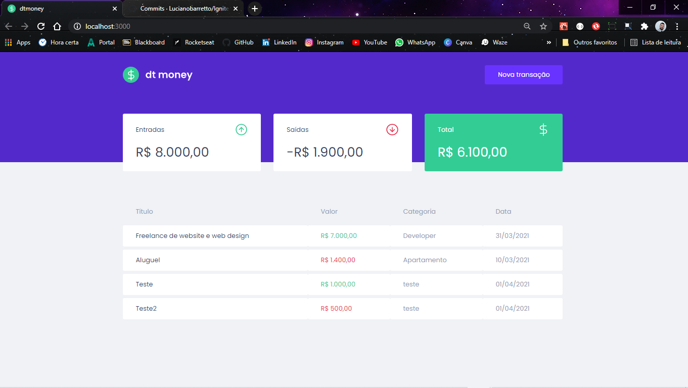
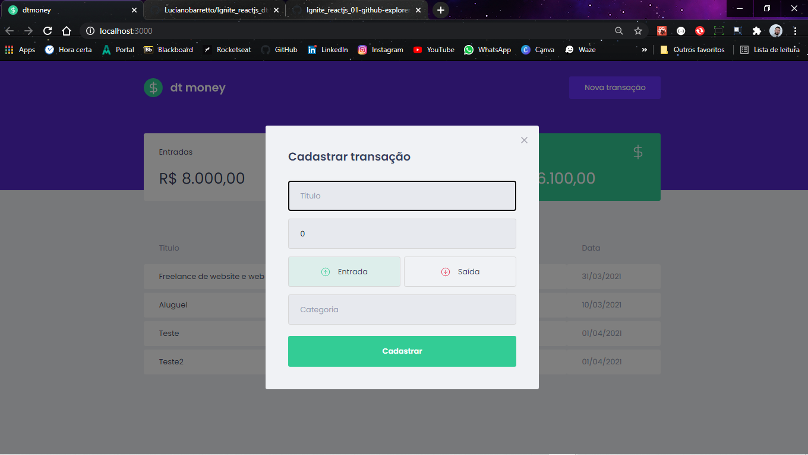
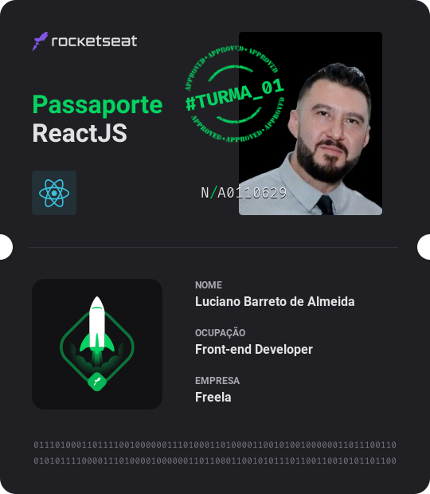

# <h1 align="center">Ignite (Trilha ReactJS - Chapter II)</h1>

<h2 align="center">dt.money - Primeira aplicação web com ReactJS (Rocketseat)</h2>

  <kbd></kbd>

  <kbd></kbd>

#

<h3 align="center">#Turma_01 - Front-end Developer N/A0110629</h3>

  <kbd></kbd>

<h5 align="center">Nesse módulo foi construído uma aplicação front-end web completa utilizando conceitos e ferramentas importantes do ecossistema React como Styled Components, MirageJS, Context API, hooks, Axios e muito mais.  :octocat:</h5>

  <kbd></kbd>

  
    

